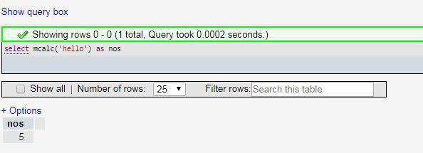

# First Mysql UDF

Sample repository to extend MySQL server by develop additional function. (MySQL UDF)

# UDF Repository for MySQL



## Extend your MySQL server with additional functions

### Compiling

```
gcc -shared -o mcalc.so sample.cc -std=c++11 -fPIC
cd sql
make mcalc.o
```

### Installing module

**Return Integer:**
```sql
CREATE FUNCTION mcalc RETURNS int SONAME "mcalc.so";
```

**(Not for this repo) Return String:**
```sql
CREATE FUNCTION mcalc RETURNS STRING SONAME "mcalc.so";
```

### Uninstalling module

```sql
DROP FUNCTION mcalc;
```

### Add module as mysql plugins

It will show path where to put the `.so` file:

```sql
SHOW VARIABLES LIKE 'plugin_dir';
```

---------

# Max Base

My nickname is Max, Programming language developer, Full-stack programmer. I love computer scientists, researchers, and compilers.

## Asrez Team

A team includes some programmer, developer, designer, researcher(s) especially Max Base.

[Asrez Team](https://www.asrez.com/)
